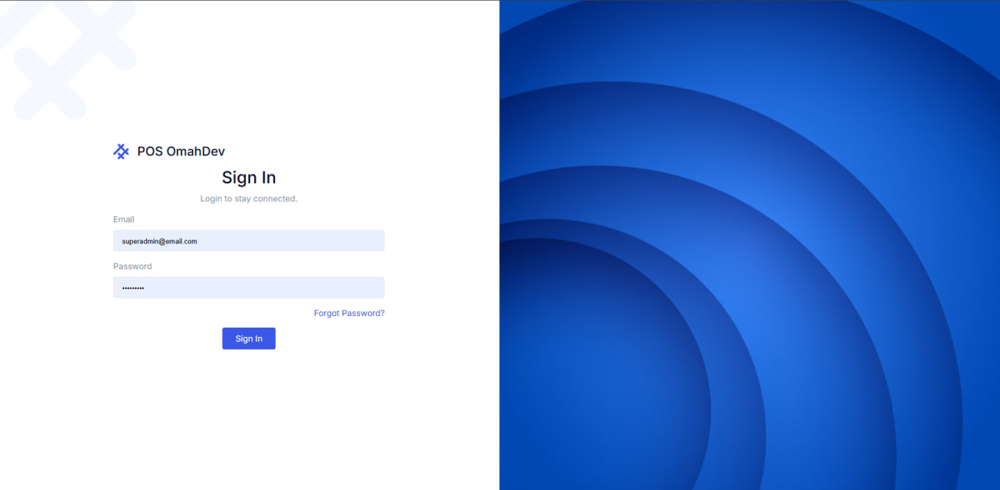

# Laravel SPA POS Demo

A custom Point of Sales (POS) single page application built with Laravel 12, Inertia.js, and Vue 3.

This project is designed as a portfolio demo for a modern sales and inventory management application. It combines server-side Laravel logic with a client-side Vue 3 interface using Inertia.js for seamless SPA behavior.

## 🚀 Tech Stack

- **Laravel 12**
- **Inertia.js**
- **Vue 3**
- **Vite**
- **Bootstrap CSS**
- **Laravel Fortify** for authentication
- **Spatie Laravel Permission** for role and permission management

## 🔧 Key Features

- Customer management
- Category and item management
- Sales transactions and sale detail tracking
- Cart handling for POS flow
- Profit recording and reporting
- User authentication and role-based access
- Single page app navigation with Inertia.js

## 📁 Main Modules

- `app/Models/Customer.php`
- `app/Models/Category.php`
- `app/Models/Item.php`
- `app/Models/Sale.php`
- `app/Models/SaleDetail.php`
- `app/Models/Cart.php`
- `app/Models/Profit.php`
- `app/Models/User.php`

## ⚙️ Installation

1. Clone the repository

   ```bash
   git clone <your-repo-url> laravel-spa
   cd laravel-spa
   ```

2. Install PHP dependencies

   ```bash
   composer install
   ```

3. Install Node dependencies

   ```bash
   npm install
   ```

4. Copy environment file and generate application key

   ```bash
   cp .env.example .env
   php artisan key:generate
   ```

5. Configure your database connection in `.env`

6. Run migrations and seeders

   ```bash
   php artisan migrate --seed
   ```

7. Start the development server

   ```bash
   php artisan serve
   npm run dev
   ```

## 🧩 Project Structure

- `app/Http/Controllers` — backend controllers handling requests
- `resources/js` — Vue 3 components and Inertia pages
- `resources/views` — Inertia entry view
- `routes/web.php` — application routes
- `database/migrations` — database schema definitions
- `database/seeders` — sample data and initial roles

## 📌 Notes

- This app uses **Inertia.js** to connect Laravel controllers with Vue 3 pages, keeping the application feeling like a true SPA.
- The frontend is built with **Vue 3**, supported by packages such as `@inertiajs/vue3`, `vue-router`, `vuex`, and `@fullcalendar/vue3`.
- The backend includes authentication via **Laravel Fortify** and permissions via **Spatie Laravel Permission**.

## 🧪 Scripts

- `npm run dev` — start Vite development server
- `npm run build` — build frontend assets for production

## 📌 Recommended Next Steps

- Customize the POS UI and add product images
- Add reporting dashboards for daily sales and profits
- Implement real-time stock updates and notifications
- Add advanced user role management for cashier and admin screens

## 📄 License

This project is licensed under the **MIT License**.
